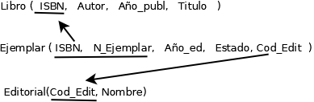

# Actividad 3.3

<a name="top"> </a>

- [Ejercicio 1](#ejerc1)
- [Ejercicio 2](#ejerc2)
- [Ejercicio 3](#ejerc3)
- [Ejercicio 4](#ejerc4)
- [Ejercicio 5](#ejerc5)
- [Ejercicio 6](#ejerc6)
- [Ejercicio 7](#ejerc7)
- [Ejercicio 8](#ejerc8)


<a name="ejerc1"></a>
## Ejercicio 1 

Relación entre delegación y ciudad. Una empresa cuenta con delegaciones en diferentes ciudades.
La empresa solamente dispondrá de una delegación por ciudad. Hay ciudades donde todavía no se
ha abierto una delegación.

### Esquema conceptual


### Esquema conceptual modificado

Coincide con el esquema conceptual

### Tablas

Al tener la cardinalidad (0,1) hacia delegación, el campo cod_postal debe pasar como clave foránea a la tabla delegación. 


Si no recordamos la regla del paso hacia la cardinalidad (0,1), se podrían generar las dos opciones y quedarnos con aquella que tenga menos valores nulos. En este ejercicio, si pasamos el campo cod_deleg a ciudad, para muchas ciudades este atributo tendrá un valor nulo. Esto se debe a que, tal y como se indica en el enunciado, no hay una delegación en todas las ciudades. 

### Normalización


- 1ª FN – Sí. Todas las claves son correctas 

- 2ª FN – Sí. Todas las claves tienen un único atributo, por lo que automáticamente están en 2ª FN

- 3ª FN – Sí. No hay dependencias transitivas


### Código SQL [[link]](Ejercicio1/actividad331.sql)

```sql

DROP DATABASE IF EXISTS empresa;
create DATABASE empresa;
USE empresa;

CREATE TABLE Delegacion (
	Cod_Deleg int AUTO_INCREMENT,
	Direccion varchar(30) NOT NULL,
	Cod_Postal varchar(5) NOT NULL, 
	CONSTRAINT Deleg_pk PRIMARY KEY(Cod_Deleg)
	
);


CREATE TABLE Ciudad (
	Cod_Postal varchar(5),
	Nombre varchar(20) NOT NULL,
	Provincia varchar(15),
	CONSTRAINT Ciudad_pk PRIMARY KEY(Cod_Postal)	
);


ALTER TABLE Delegacion 
	ADD CONSTRAINT Deleg_Ciud_fk 
	FOREIGN KEY (Cod_Postal) 
	REFERENCES Ciudad(Cod_Postal)
	ON UPDATE CASCADE
	ON DELETE NO ACTION;


```

[Inicio](#top)

<a name="ejerc2"></a>
## Ejercicio 2

Relación entre países y localidades 

### Esquema conceptual


### Esquema conceptual modificado

Coincide con el esquema conceptual, ya que no hay relaciones M:N ni entidades débiles


### Tablas


### Normalización

- 1ª FN – Sí. Todas las claves son correctas 

- 2ª FN – Sí. Todas las claves tienen un único atributo, por lo que automáticamente están en 2ª FN

- 3ª FN – Sí. No hay dependencias transitivas

### Código SQL [[link]](Ejercicio2/actividad332.sql)


```sql 

DROP DATABASE IF EXISTS municipios;
create DATABASE municipios;
USE municipios;

CREATE TABLE Pais (
	Cod_Pais int,
	Nombre varchar(30) NOT NULL,
	Continente varchar(30) NOT NULL,
	Extension float,
	N_hab int,
	Cod_capital int NOT NULL,
	CONSTRAINT Pais_pk PRIMARY KEY (Cod_Pais),
	CONSTRAINT Pais_ext_ck CHECK (Extension > 0),
	CONSTRAINT Pais_nhab_ck CHECK (N_hab >= 0)
);
CREATE TABLE Municipio (
	Cod_Munic int,
	Nombre varchar(30) NOT NULL,
	N_habit int,
	Cod_Pais int,
	CONSTRAINT Municipio_pk PRIMARY KEY (Cod_Munic),
	CONSTRAINT Municipio_nhab_ck CHECK (N_habit >= 0),
	CONSTRAINT Municipio_pais_fk 
	FOREIGN KEY (Cod_Pais) 
	REFERENCES Pais(Cod_Pais)
	ON UPDATE CASCADE
	ON DELETE NO ACTION
);

ALTER TABLE Pais ADD CONSTRAINT Pais_Munic_capital_fk 
	FOREIGN KEY (Cod_capital)	
	REFERENCES Municipio(Cod_Munic)
	ON UPDATE CASCADE 
	ON DELETE NO ACTION;

```

[Inicio](#top)

<a name="ejerc3"></a>
## Ejercicio 3

Alumno y delegado

### Esquema conceptual


### Esquema conceptual modificado

Coincide con el esquema conceptual

### Tablas


### Normalización

- 1FN => Todos los atributos no clave dependen funcionalmente de la clave

- 2FN => La clave primaria de la tabla tiene solo un atributo, por lo que automáticamente está en segunda forma normal

- 3FN => No existen dependencias transitivas, por lo que está en 3FN

### Código SQL [[link]](Ejercicio3/act33_3_EGZ.sql)

```sql

drop database if exists act33_3_EGZ;

create database act33_3_EGZ;

use act33_3_EGZ;

create table Alumnos (
	NIE VARCHAR(8),
	Nombre VARCHAR(20) NOT NULL,
	Apellido1 VARCHAR(20) NOT NULL,
	Apellido2 VARCHAR(20),
	Num_Lista INT NOT NULL,
	Num_Clase INT NOT NULL,
	NIE_Delegado VARCHAR(8),
	CONSTRAINT Alumnos_pk PRIMARY KEY (NIE)
	
);

-- La clave foránea se puede crear en el comando CREATE TABLE o con ALTER TABLE

ALTER TABLE Alumnos ADD CONSTRAINT Alumnos_del_fk 
	FOREIGN KEY (NIE_Delegado)
	REFERENCES Alumnos(NIE)
	ON UPDATE CASCADE
	ON DELETE SET NULL;

```

[Inicio](#top)

<a name="ejerc4"></a>
## Ejercicio 4


### Esquema conceptual


### Esquema conceptual modificado


### Tablas



### Código SQL  [[link]](Ejercicio4/act33ej4ak.sql)

```sql


DROP DATABASE IF EXISTS act33ej4ak;

CREATE DATABASE act33ej4ak;

USE act33ej4ak;

CREATE TABLE Libro(
    ISBN VARCHAR(12),
    Autor VARCHAR(20),
    Año_publ YEAR,
    Titulo VARCHAR(20),
    CONSTRAINT ISBN_Libro_PK PRIMARY KEY (ISBN)
);


CREATE TABLE Editorial(
     Cod_Editorial varchar(5),
     Nombre Varchar(20),
     CONSTRAINT Editorial_PK PRIMARY KEY(Cod_Editorial)
);

CREATE TABLE Ejemplar(
    ISBN VARCHAR(12),
    N_Ejemplar INT,
    Año_ed YEAR,
    Estado VARCHAR(10),
    Cod_Editorial varchar(5),
    CONSTRAINT N_Ejemplar_Ejemplar_PK PRIMARY KEY (N_Ejemplar, ISBN),
    CONSTRAINT ISBN_Libro_FK
    FOREIGN KEY (ISBN)
    REFERENCES Libro (ISBN)
    ON UPDATE CASCADE
    ON DELETE NO ACTION,
    CONSTRAINT Cod_Ed_fk 
    FOREIGN KEY (Cod_Editorial)
    REFERENCES Editorial(Cod_Editorial)
    ON UPDATE CASCADE
    ON DELETE NO ACTION
);

```

[Inicio](#top)

<a name="ejerc5"></a>
## Ejercicio 5


### Esquema conceptual


### Esquema conceptual modificado


### Tablas


### Normalización

- 1FN => Todos los atributos no clave dependen funcionalmente de la clave

- 2FN => La clave primaria de la tabla tiene solo un atributo, por lo que automáticamente está en segunda forma normal

- 3FN => No existen dependencias transitivas, por lo que está en 3FN

### Código SQL  [[link]](Ejercicio5/EJ5-3.3-AGM.sql)

```sql

DROP DATABASE IF EXISTS EJ5ACT3AGM;
CREATE DATABASE EJ5ACT3AGM;

USE EJ5ACT3AGM;

CREATE TABLE CUENTA(
	N_CUENTA VARCHAR(24),
	SALDO FLOAT NOT NULL,
	SUCURSAL VARCHAR(20) NOT NULL,
	BANCO VARCHAR(20) NOT NULL,
	CONSTRAINT Cuenta_pk PRIMARY KEY(N_CUENTA)
);

CREATE TABLE TRANSACCIÓN(
	COD_TRANS VARCHAR(10),
	N_CUENTA_REALIZA VARCHAR(24),
	CONCEPTO VARCHAR(20) NOT NULL,
	CANTIDAD FLOAT NOT NULL,
	FECHA DATETIME NOT NULL,
	N_CUENTA_RECIBE VARCHAR(10),
	CONSTRAINT TRANSACCIÓN_PK PRIMARY KEY (COD_TRANS, N_CUENTA_REALIZA),
	CONSTRAINT N_CUENTA_REALIZA_FK 
	FOREIGN KEY (N_CUENTA_REALIZA) 
	REFERENCES CUENTA(N_CUENTA)
	ON UPDATE CASCADE
	ON DELETE CASCADE,
	CONSTRAINT N_CUENTA_RECIBE_FK 
	FOREIGN KEY (N_CUENTA_RECIBE) 
	REFERENCES CUENTA(N_CUENTA)
	ON UPDATE CASCADE
	ON DELETE NO ACTION
);

```

[Inicio](#top)

<a name="ejerc6"></a>
## Ejercicio 6
 Clasificación de las cuentas de un banco: ahorro y corriente

### Esquema conceptual


### Esquema conceptual modificado


### Tablas


### Normalización

- 1FN => Todos los atributos no clave dependen funcionalmente de la clave

- 2FN => La clave primaria de la tabla tiene solo un atributo, por lo que automáticamente está en segunda forma normal

- 3FN => No existen dependencias transitivas, por lo que está en 3FN

### Código SQL  [[link]](Ejercicio6/act33_6_EGZ.sql)

```sql

drop database if exists act33_6_EGZ;

create database act33_6_EGZ;

use act33_6_EGZ;

create table Cliente (
	DNI VARCHAR(9),
	Nombre VARCHAR(20) NOT NULL,
	Apellido1 VARCHAR(20) NOT NULL,
	Apellido2 VARCHAR(20),
	CONSTRAINT Cliente_pk
	PRIMARY KEY (DNI)
);

create table Cuenta_Bancaria (
	IBAN VARCHAR(24),
	Nombre_Banco VARCHAR(20) NOT NULL,
	CONSTRAINT Cuenta_Bancaria_pk
	PRIMARY KEY (IBAN)
);

create table Cliente_Cuenta_Bancaria (
	DNI VARCHAR(9),
	IBAN VARCHAR(24),
	CONSTRAINT Cliente_Cuenta_Bancaria_pk
	PRIMARY KEY (DNI,IBAN),

	CONSTRAINT DNI_fk
	FOREIGN KEY (DNI)
	REFERENCES Cliente(DNI)
	ON UPDATE CASCADE
	ON DELETE NO ACTION,

	CONSTRAINT IBAN_fk
	FOREIGN KEY (IBAN)
	REFERENCES Cuenta_Bancaria(IBAN)
	ON UPDATE CASCADE
	ON DELETE NO ACTION
);

create table Corriente (
	IBAN VARCHAR(24),
	Num_Cheque INT NOT NULL,
	CONSTRAINT Corriente_pk
	PRIMARY KEY (IBAN),
	CONSTRAINT IBAN_corriente_fk
	FOREIGN KEY (IBAN)
	REFERENCES Cuenta_Bancaria(IBAN)
	ON UPDATE CASCADE
	ON DELETE CASCADE 
);

create table Ahorro (
	IBAN VARCHAR(24),
	Fecha_Renov DATE NOT NULL,
	Interés FLOAT NOT NULL,
	CONSTRAINT Ahorro_pk
	PRIMARY KEY (IBAN),
	CONSTRAINT IBAN_ahorro_fk
	FOREIGN KEY (IBAN)
	REFERENCES Cuenta_Bancaria(IBAN)
	ON UPDATE CASCADE
	ON DELETE CASCADE 
);

```

[Inicio](#top)

<a name="ejerc7"></a>
## Ejercicio 7

<div style="text-align:justify"> La Consejería de Educación gestiona varios tipos de centros: públicos, privados y concertados. Los
privados tienen un atributo específico que es la cuota y los concertados la agrupación y la comisión.
También asigna plazas a los profesores de la comunidad para impartir clase en esos centros. Un
profesor puede impartir clase en varios centros. </div>

### Esquema conceptual


### Esquema conceptual modificado


### Tablas


### Normalización

- 1FN => Todos los atributos no clave dependen funcionalmente de la clave

- 2FN => Todas las tablas tienen un único atributo como clave primaria o, en el aso de que tengan más de un atributo como clave primaria, no tienen otros campos. Poreso todas las tablas están en 2FN

- 3FN => No existen dependencias transitivas, por lo que está en 3FN

### Código SQL  [[link]](Ejercicio7/act33_7_EGZ.sql)

```sql
drop database if exists act33_7_EGZ;

create database act33_7_EGZ;

use act33_7_EGZ;

create table Etapa_Educativa (
	Nombre VARCHAR(20),
	CONSTRAINT Etapa_Educativa_pk
	PRIMARY KEY (Nombre)
);

create table Centro (
	Cod_Centro VARCHAR(6),
	Nombre VARCHAR(20) NOT NULL,
	Localidad VARCHAR(30) NOT NULL,
	CONSTRAINT Centro_pk
	PRIMARY KEY (Cod_Centro)
);

create table Etapa_Educativa_Centro (
	Nombre VARCHAR(20),
	Cod_Centro VARCHAR(6),
	CONSTRAINT Etapa_Educativa_Centro_pk
	PRIMARY KEY (Nombre, Cod_Centro),

	CONSTRAINT Nombre_fk
	FOREIGN KEY (Nombre)
	REFERENCES Etapa_Educativa(Nombre)
	ON UPDATE CASCADE
	ON DELETE CASCADE,

	CONSTRAINT Cod_Centro_Etapa_fk
	FOREIGN KEY (Cod_Centro)
	REFERENCES Centro(Cod_Centro)
	ON UPDATE CASCADE
	ON DELETE CASCADE
);

create table Profesor (
	DNI VARCHAR(9),
	Nombre VARCHAR(20) NOT NULL,
	Apellido1 VARCHAR(20) NOT NULL,
	Apellido2 VARCHAR(20),
	Dirección VARCHAR(30),
	CONSTRAINT Profesor_pk
	PRIMARY KEY (DNI)
);

create table Centro_Profesor (
	Cod_Centro VARCHAR(6),
	DNI VARCHAR(9),
	CONSTRAINT Centro_Profesor_pk
	PRIMARY KEY (Cod_Centro,DNI),

	CONSTRAINT Cod_Centro_Profesor_fk
	FOREIGN KEY (Cod_Centro)
	REFERENCES Centro(Cod_Centro)
	ON UPDATE CASCADE
	ON DELETE CASCADE,

	CONSTRAINT DNI_fk
	FOREIGN KEY (DNI)
	REFERENCES Profesor(DNI)
	ON UPDATE CASCADE
	ON DELETE CASCADE
);

create table Público (
	Cod_Centro VARCHAR(6),
	CCAA VARCHAR(20),
	CONSTRAINT Público_pk
	PRIMARY KEY (Cod_Centro),

	CONSTRAINT Cod_Centro_Publico_fk
	FOREIGN KEY (Cod_Centro)
	REFERENCES Centro(Cod_Centro)
	ON UPDATE CASCADE
	ON DELETE CASCADE
);

create table Privado (
	Cod_Centro VARCHAR(6),
	Cuota FLOAT,
	CONSTRAINT Privado_pk
	PRIMARY KEY (Cod_Centro),

	CONSTRAINT Cod_Centro_Privado_fk
	FOREIGN KEY (Cod_Centro)
	REFERENCES Centro(Cod_Centro)
	ON UPDATE CASCADE
	ON DELETE CASCADE
);

create table Concertado (
	Cod_Centro VARCHAR(6),
	Agrupación VARCHAR(20),
	Comisión FLOAT,
	CONSTRAINT Concertado_pk
	PRIMARY KEY (Cod_Centro),

	CONSTRAINT Cod_Centro_Concertado_fk
	FOREIGN KEY (Cod_Centro)
	REFERENCES Centro(Cod_Centro)
	ON UPDATE CASCADE
	ON DELETE CASCADE
);

```

[Inicio](#top)

<a name="ejerc8"></a>
## Ejercicio 8

<div style="text-align:justify" > 
A un taller de automóviles llegan clientes a comprar coches. De los coches nos interesa saber la
marca, el modelo, el color y el número de bastidor. Los coches pueden ser nuevos y de segunda
mano. De los nuevos nos interesa saber las unidades que hay en el taller. De los viejos el año de
fabricación, el número de averías y la matrícula.
<br>
Los mecánicos se encargan de poner a punto los coches usados del taller. Un mecánico pone a punto
a varios coches usados. Un cliente puede comprar varios coches; un coche puede ser comprado por
varios clientes. De la compra nos interesa la fecha y el precio.</div>

### Esquema conceptual


### Esquema conceptual modificado


### Esquema conceptual modificado

### Tablas

### Normalización

### Código SQL

[Inicio](#top)